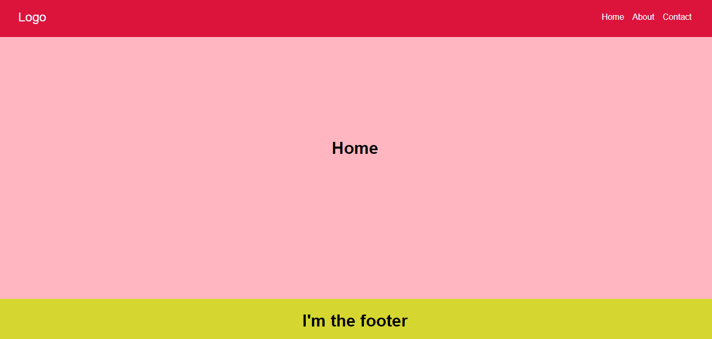

## How to set us routing system using Vanilla JS

You'll find on the internet many differents ways to create routes using vanilla JS. But in this repository I'm gonna show the simple way to do it using `url route`

First of all you need to create your main page and set the content with the id of content like this 
````html
<main id="content"></main>
````

In this spacial div will go all our routes.

so here below I'm gonna show you my `index.html` file

```html
<header>
    <nav class="navbar">
        <div class="navbar__logo">
            <a href="/" class="logo">Logo</a>
        </div>
        <ul class="navbar__list">
            <li class="navbar__item"><a href="/">Home</a></li>
            <li class="navbar__item"><a href="/about">About</a></li>
            <li class="navbar__item"><a href="/contact">Contact</a></li>
        </ul>
    </nav>
</header>

<main id="content">

</main>

<footer>
    <h1>I'm the footer</h1>
</footer>
```

here you have the <a href="./js/main.js">JavaScript</a>

